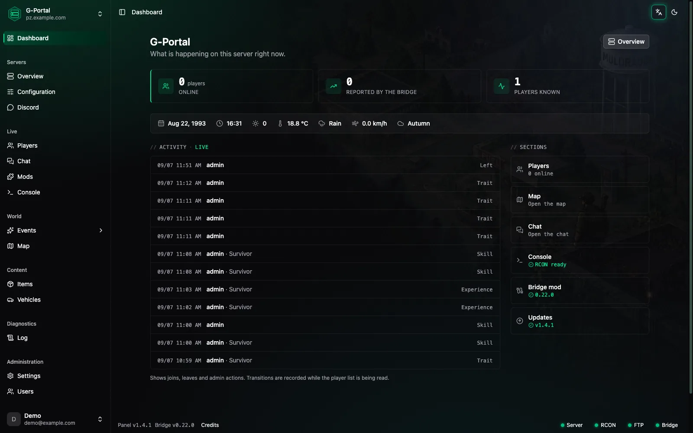
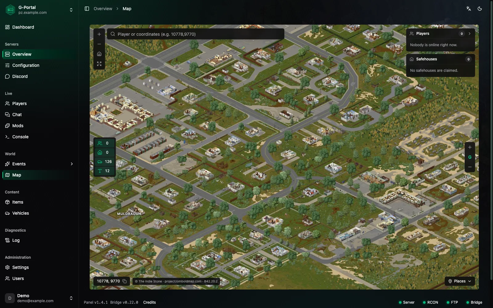
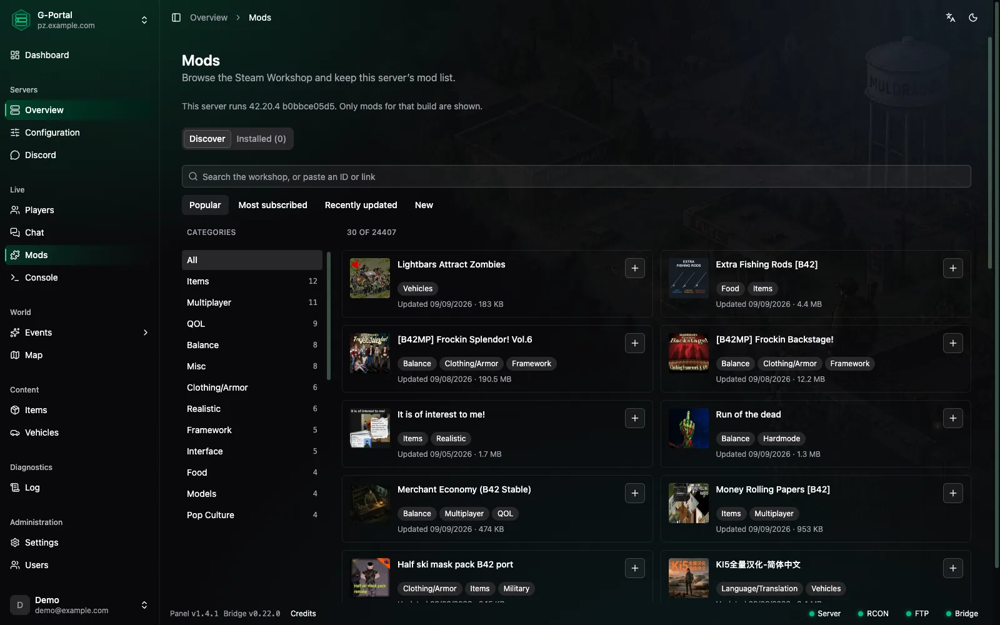
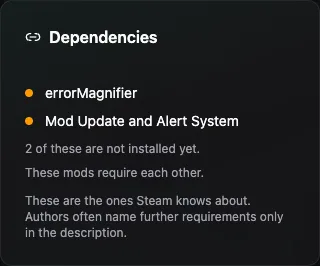
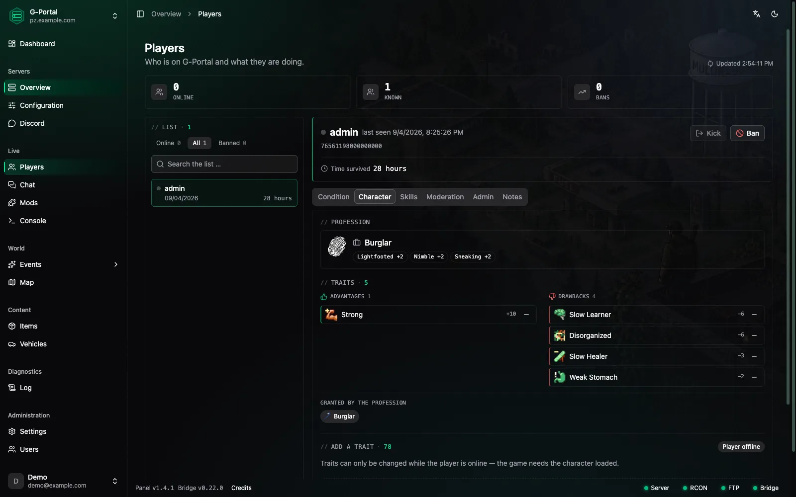
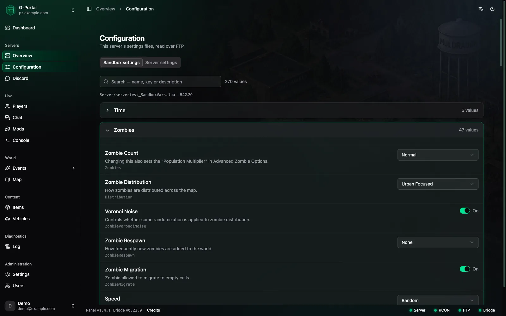
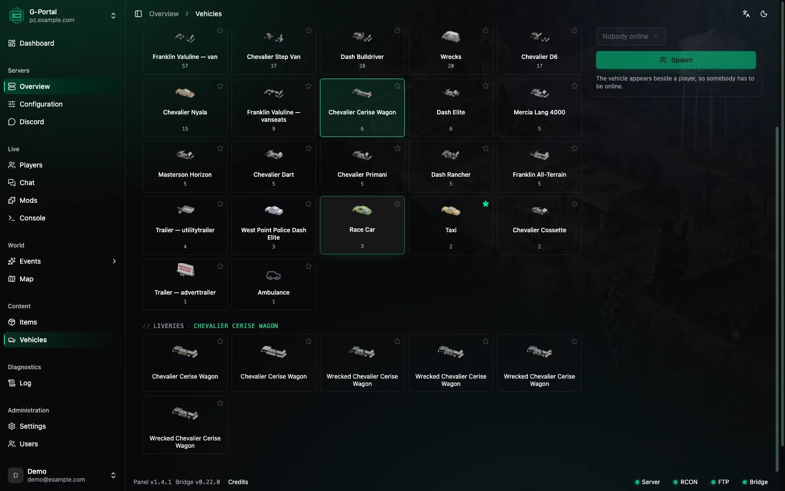
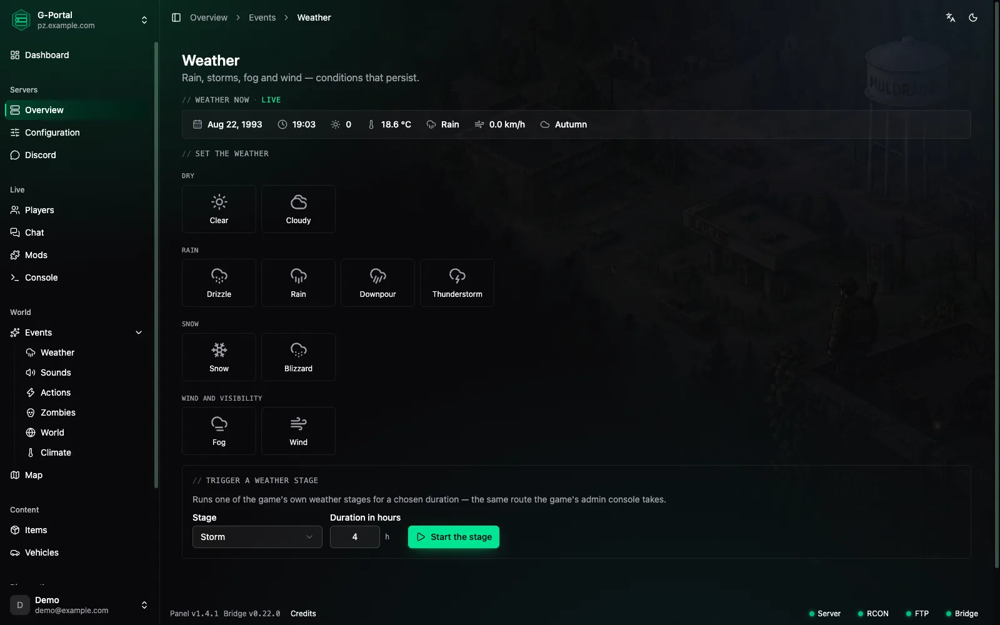

# ZomboidControl

[](https://github.com/zone1987/zomboid-control-panel/actions/workflows/main.yml)
[](https://github.com/zone1987/zomboid-control-panel/releases/latest)
[](https://github.com/zone1987/zomboid-control-panel/pkgs/container/zomboid-control-panel)
[](backend/composer.json)
[](frontend/package.json)
[](LICENSE)

> 🇩🇪 [Deutsche Fassung](README_DE.md) · 🗺️ [Roadmap](ROADMAP.md)

**Run your Project Zomboid server from a web browser.**

Who is online and how are they doing? Where is everyone on the map? Change
the weather, kick somebody, read the chat, edit the server settings — all
from a web page, from anywhere, without logging into anything over SSH.

The panel does **not** run on your game server. It runs somewhere else —
your own computer, a small rented server, or a hosting provider — and
connects to your game server the same way you would: through file access
and the remote control the game already has.

> Free, non-commercial, and not an official product of The Indie Stone.

---

## Before you start

**You do not need to be technical.** This guide assumes you have never set
up a server before. Everything you need to type is here to copy.

**Set aside about 20 minutes** for the first installation.

**Two ways to install it:**

| Way                                            | Who it is for                                                        |
| ---------------------------------------------- | -------------------------------------------------------------------- |
| **[Coolify](#way-a-coolify-recommended)**      | Recommended. You click through a web interface, and HTTPS is handled for you |
| **[Docker](#way-b-docker-on-your-own-computer)** | If you want to try the panel out on your own machine                |

After that, both ways continue the same.

---

## Contents

1. [A look at it](#a-look-at-it)
2. [What the panel does](#what-the-panel-does)
3. [What you need from your game server](#what-you-need-from-your-game-server)
4. [Way A: Coolify (recommended)](#way-a-coolify-recommended)
5. [Way B: Docker on your own computer](#way-b-docker-on-your-own-computer)
6. [Logging in for the first time](#logging-in-for-the-first-time)
7. [Connecting your game server](#connecting-your-game-server)
8. [The Lua bridge — the piece that makes it worth it](#the-lua-bridge--the-piece-that-makes-it-worth-it)
9. [Connecting Discord](#connecting-discord)
10. [Updating](#updating)
11. [Backups](#backups)
12. [When something does not work](#when-something-does-not-work)
13. [All settings at a glance](#all-settings-at-a-glance)
14. [What the panel deliberately cannot do](#what-the-panel-deliberately-cannot-do)
15. [Game content and licence](#game-content-and-licence)
16. [Roadmap](ROADMAP.md) — what is planned next

---

## A look at it

### The dashboard — everything at a glance

[](docs/images/dashboard.webp)

Who is online, what the weather is doing, the in-game date and time, and
whether RCON, FTP and the bridge are answering — each reported
separately, because they fail separately. The activity strip below
records joins, leaves and every admin action, so "who did that, and
when" is one glance rather than a log file.

<br>

### The map — the world, with your people on it

[](docs/images/map.webp)

Pan and zoom the real map, with players and vehicles drawn where they
actually are — the vehicles from the game's own 3D models, not icons.
Safehouses and claimed areas show as outlines. Type a name or a pair of
coordinates to jump there, and copy any position back out for a
teleport.

<br>

### Mods — the Steam Workshop, inside the panel

[](docs/images/mods.webp)

Search by name, filter by category, sort by popular or recently updated
— and add a mod to your server with the button on its tile. Only mods
for your server's build are offered, and the build comes from the bridge
rather than a guess. No copying ids out of browser tabs: the panel keeps
`WorkshopItems=` and `Mods=` in step and reads the real mod ids off your
server.

<br>

### Dependencies — resolved for you



A mod that needs other mods says so, and the panel offers to install
them with it. Anything already on your server is recognised, so it does
not ask twice, and two mods that require each other are named once with
a note rather than drawn as an endless tree.

The panel is honest about the limit: these are the ones Steam knows
about, and authors often name more only in the description.

<br clear="all">

<br>

### Players — a dossier each

[](docs/images/player-character.webp)

Profession with the bonuses it grants, traits split into advantages and
drawbacks with the game's own ratings, and tabs for condition, skills,
moderation and admin.

The **Skills** tab sets a level by clicking the mark you want — click
level 7 on Carpentry and it is set. **Moderation** holds kicks, bans,
access levels and teleports. **Admin** holds invincibility, invisibility
and the rest, each shown as *unknown* until the panel has set it,
because the game will not read those back.

<br>

### Configuration — your settings files, as an interface

[](docs/images/config.webp)

All 270 sandbox values and the whole server INI, grouped and explained,
with the right control for each one — a chooser where the game offers a
choice, a switch where it is on or off, a number field where it is a
number. The real key is printed under every option, so you always know
what you are editing.

The panel backs the file up before writing and reads it back afterwards,
and it says which changes need a restart and which the game picks up
while running.

<br>

### Vehicles — pick one by looking at it

[](docs/images/vehicles.webp)

All 241 base-game vehicles plus whatever your mods add, rendered from
the game's own models, with every livery a body has — police, taxi,
ambulance, and the wrecked variants. Filter by type, star your
favourites, then spawn one beside a player who is online.

<br>

### Weather — see it before you change it

[](docs/images/weather.webp)

The live conditions sit at the top — date, time, temperature, wind,
season — and the presets below set rain, storms, snow, fog or clear
skies with one click. Under them, the game's own weather stages can be
run for a chosen number of hours, the same route the admin console
takes. Sounds, zombie events and world events have their own pages
beside this one.

---

## What the panel does

The short version: everything reachable over files and RCON — and with
the [Lua bridge](#the-lua-bridge--the-piece-that-makes-it-worth-it),
that turns out to be most of the game. Entries marked **bridge** need
it; everything else works without.

### Players

- **Who is online**, live, with their access level and how long they
  have been connected.
- **Health and condition** — all 24 statistics the game keeps, with
  hunger, thirst, fatigue, endurance, pain, panic, stress, sickness and
  infection shown first and the rest a click away. Every bound is read
  from the game, not assumed: they run 0–1, 0–100, −1–1 and 20–40
  depending on the value. **bridge**
- **Skills and traits** — all skills with their level and experience,
  plus the character's traits and profession. **bridge**
- **Change a character** — set a skill level, award experience, add or
  remove a trait, heal, and set the carry weight. Each control shows
  the value you asked for while it is still unconfirmed. **bridge**
- **Position on the map**, and what is around a player. **bridge**
- **Kick**, **ban** and **unban** — by name or by SteamID, with a
  reason, permanently or for a number of days. Expired bans are lifted
  automatically.
- **Teleport** one player to another.
- **Access levels** — from observer through to admin.
- **Give items** to a player, any amount.
- **Notes per player**, so the panel remembers why somebody was
  warned.
- **Ban list** and a **history** of everything ever done to an account.
- **Retention** — a horizon for players nobody has seen in months, set
  by you and **off by default**. It never touches the ban list.
- **Data protection per player** — export or erase one player's data
  without opening the database.

### Map

- **The world**, with your players and vehicles drawn on it, panning
  and zooming.
- **Vehicles rendered from the game's own models**, not from icons.
- **Safehouses and factions** shown as areas. **bridge**

### Vehicles

- **All 241 base-game vehicles** plus whatever your mods add, with the
  real capacities, seat counts and part lists read out of the game.
  **bridge**
- **Pick by sight** — body renders and a livery grid instead of a list
  of `Base.*` names.
- **Spawn one** next to a player, in the livery you picked.

### Items

- **Your server's real item list** — the base game plus everything the
  mods bring, with the icons from your own installation. **bridge**
- **Search and filter**, and hand anything out from the same page.
- **Names in your language**, read from the game's own translation
  files rather than typed into the panel.

### Mods and the Steam Workshop

- **Browse the Workshop in the panel** — search by name, filter by
  category, and see cover, author, rating and categories at a glance.
  Searching needs a [Steam Web API
  key](#all-settings-at-a-glance); without one you add mods by ID or
  link and the panel says so rather than showing an error.
- **A detail page per mod** — gallery, description, author, size,
  published and updated dates, changelog, and links to the Workshop
  discussions and comments.
- **Add and remove with one click.** The panel keeps `WorkshopItems=`
  and `Mods=` in step, and reads the mod IDs out of the `mod.info`
  files on your server rather than guessing them.
- **Dependencies, resolved** — the panel reads what a mod requires,
  draws the tree, and offers to install the missing pieces with it.
  Anything already installed is recognised, so it does not ask twice.
- **Load order** — a topological sort that puts dependencies before
  what needs them, with a preview before anything is written. A
  circular dependency is reported as one, not silently reordered.
- **Diagnosis** — a workshop ID with no mod ID, a mod ID with no
  download, a stray character in an entry. Each is named separately,
  and "not downloaded yet" is kept apart from "missing".
- **Repair** — fix mod IDs that a leading slash or backslash has made
  unusable.
- **Map mods** are recognised and `Map=` is maintained alongside.
- **Build filter** — only mods for your server's build are offered.
  The build comes from the bridge; if it is unknown, the panel filters
  nothing rather than guessing. **bridge**
- **Update watch** — the panel notices when an installed mod has been
  updated on Steam, and can announce it in Discord.
- **Covers are cached** in the panel, scaled and re-encoded, with an
  upper bound on the space they take.

### Weather, events and the world

- **Weather** — rain, storm, snow, fog and clearing, with intensity in
  the unit the display uses, and the live state read back from the
  game. **bridge**
- **All thirteen climate values** as a state you can see and change,
  not as thirteen buttons to fire. **bridge**
- **Events** — lightning, thunder, helicopter, gunshots, sirens and
  the rest of the game's own sound and world events.
- **Zombie events** — hordes and the game's zombie triggers.
- **Time of day** as an arc from midnight to midnight, with daylight
  shown beneath it because the two interact.
- **Power and water** on or off.
- **A preview before anything happens**, and a verdict from the server
  afterwards rather than "the call did not throw".

### Server configuration

- **The whole server INI**, with every option explained, grouped
  sensibly, and typed — a number is a number field, a choice is a
  chooser.
- **Every sandbox value**, the same way.
- **The panel says which changes need a restart** and which the game
  picks up while running. It measured that rather than assuming it.
- **A backup before every write**, and the file is read back
  afterwards to confirm what landed.
- **Only what you changed is sent**, so an untouched RCON password is
  never rewritten with its own mask.
- **A file browser** over FTP/SFTP, so you click your way to a path
  instead of typing it.

### Console and chat

- **The game's remote control**, with your own server's command list
  and a history.
- **Read the chat** from the log files, and write into it.
- **Mirror the chat into Discord**, optionally.

### Logs

- **Read your server's log files** in the panel, tailing the end of a
  file without downloading the whole thing.

### Discord

- **Notifications** into a channel you choose — every event switchable
  on its own, and **everything is off to begin with**.
- **Which events**: a player joining or leaving, kicks, bans, unbans,
  access level changes, console commands, broadcasts, items handed
  out, teleports, events triggered, healing, skills, traits, statistics
  and experience — plus the server becoming unreachable or reachable,
  the bridge going quiet or answering again, the panel or the bridge
  being updated, and mods being added, removed or having an update.
- **Every message is a template you can edit**, with the placeholders
  listed beside the field.
- **Mod messages carry a card** — the mod's cover, name, version and a
  link straight to its Workshop page.
- **Chat mirroring** from the game into a channel.
- **Slash commands** — `/spieler`, `/welt`, `/wetter` and `/server`
  with subcommands for listing players, kicks, bans, teleports, items,
  access levels, time, power, water, the weather, the server status,
  broadcasts, saving and RCON. Player and item names complete as you
  type.
- **Rights per command.** A Discord administrator may use everything;
  beyond that you assign Discord roles per command, and each command
  costs the same panel permission the equivalent button does. Discord
  is never a shortcut past your rights.
- **A test send** for every message type before you switch it on.

### Users, roles and security

- **Several accounts**, each with its own role.
- **Roles with per-page permissions** — 22 of them, grouped, and the
  ones that hand over more than they appear to are marked as such.
- **Invitations by email**, with an expiry.
- **Two-factor login** — authenticator apps and **passkeys**, with
  recovery codes shown once.
- **Sign in with Google** or with **Steam**, optionally, and linkable
  to an existing account.
- **Password reset** by email.
- **An action log** — who did what, when, and to whom.
- **FTP, RCON and TOTP secrets are encrypted** (they have to be
  readable again); passwords, recovery codes and invitation tokens are
  hashed.

### The panel itself

- **A dashboard** with the state of every server at a glance.
- **Connection status per server**, split into what actually works:
  RCON, FTP, the bridge and Discord are reported separately, because
  they fail independently.
- **Bridge management** — upload it from the panel, and see three
  things kept apart: what this panel ships, what is on disk, and what
  is **running in the game**. Only the third answers commands.
- **Update notice** in the header when a newer release exists, and
  **automatic deployment** through the Coolify webhook if you switch it
  on.
- **Email setup in the panel**, with presets for the common providers,
  a test send, and a check of your SPF, DKIM and DMARC records.
- **A cache page** that names what it clears and says what it leaves
  alone, because some of those keys are positions rather than caches.
- **Seven languages** — English and German written by hand; Spanish,
  French, Italian, Polish and Russian machine-translated and marked as
  such in the switcher. Corrections are very welcome as an issue.
- **Light and dark theme.**
- **Built for accessibility** — BFSG-compliant, contrasts computed
  rather than eyeballed, no meaning carried by colour alone, and
  `prefers-reduced-motion` honoured. Lighthouse 100 on all four scores
  is the target.
- **Works on a phone** — no horizontal scrolling, tables become cards,
  and every touchable control is at least 32 px.
- **No analytics, no CDN fonts, no trackers.** The content security
  policy enforces it.

---

## What you need from your game server

Three things. You get the first two from your hosting provider — usually
in their control panel under "credentials" or "FTP".

### 1. RCON — the game's remote control

This is how the panel tells the game what to do: kick, ban, change the
weather, send messages.

You need: **address**, **port** (usually `27015`) and **password**.

*Running the server yourself?* The values are in your server INI under
`RCONPort` and `RCONPassword`. If there is no password set, RCON is off —
add one and restart the server.

### 2. FTP or SFTP — file access

This is how the panel reads and writes the configuration, reads the log
files for the chat, and uploads the bridge.

You need: **address**, **port**, **username** and **password**.

### 3. The Lua bridge — optional, but worth it

A small file the panel uploads to your server itself. Most things work
without it; with it, the panel becomes what it is meant to be. More on it
[below](#the-lua-bridge--the-piece-that-makes-it-worth-it).

---

## Way A: Coolify (recommended)

This assumes you already have Coolify running and can log into it.

**What you need besides that:** a domain pointing at your Coolify server —
an `A` record to its IP address. Coolify takes care of the HTTPS
certificate itself.

### Step 1 — Create the project in Coolify

1. In Coolify: **+ New** → **Project**, give it a name (`ZomboidControl`).
2. Inside the project: **+ New Resource**.
3. Choose **Public Repository**.
4. Enter as the repository:
   ```
   https://github.com/zone1987/zomboid-control-panel
   ```
5. As the **Build Pack**, choose **Docker Compose**. The default
   location (`/docker-compose.yaml`) is correct — there is nothing to
   change.
6. **Continue**.

### Step 2 — Enter your domain

Under **Configuration → General** you will find the **Domains** field.
Enter your domain, with `https://` in front:

```
https://zomboid.your-domain.com
```

Coolify requests the certificate itself as soon as the domain resolves to
its server.

### Step 3 — One variable, and only if the port is taken

**Normally there is nothing to set.** Coolify passes the domain you
entered as `COOLIFY_URL`, and the panel builds everything from it —
passwords, encryption keys and the database password are generated on
first start and kept in a volume. Mail, Google sign-in and the Steam key
are configured in the panel itself, under *Settings*, each with a test
button.

One case where you do add something under **Environment Variables**:

| Name             | When                                                             |
| ---------------- | ----------------------------------------------------------------- |
| `APP_PUBLIC_URL` | if the log says no public address is set, or you want a different address than the one Coolify routes |

> **Keep a copy of the encryption key once it exists.** After the first
> start you will find it under *Settings → Security*. It encrypts the FTP
> and RCON passwords, so a database backup without it restores everything
> except those. Save it to your password manager the first time you log in.

### Step 4 — Deploy

Click **Deploy**. Coolify builds the panel and starts it. The first time
this takes a few minutes — you can watch in the log window.

It is ready when it says **Running** at the top. Then open:

```
https://zomboid.your-domain.com/app
```

Continue at [logging in for the first
time](#logging-in-for-the-first-time).

### Coolify: what else you can do afterwards

- **Automatic updates.** Not the **Automatic Deployment** switch under
  *Configuration → General* — it watches a git repository, and this
  panel ships as an image, so there is nothing there for it to see. The
  deploy webhook does the job instead: [Updating without clicking
  anything](#updating-without-clicking-anything).
- **Restart.** The **Restart** button at the top right.
- **Read the log.** The **Logs** tab — it shows what the panel does at
  start and whether anything is missing.
- **Database backups.** Coolify can back the database up automatically: in
  the `database` resource under **Backups**. See also
  [backups](#backups).

---

## Way B: Docker on your own computer

For when you want to try the panel out first, or run it on your home
network.

**You need:** [Docker Desktop](https://www.docker.com/products/docker-desktop/)
(Windows, macOS) or Docker with the Compose plugin (Linux).

### Step 1 — Get the files

```bash
git clone https://github.com/zone1987/zomboid-control-panel.git
cd zomboid-control-panel
cp .env.example .env
```

> **No `git`?** You can also download the repository from GitHub as a ZIP,
> unpack it, and open a terminal in the unpacked folder. Rename the file
> `.env.example` to `.env` there.

### Step 2 — Set your address

Open `.env` in a text editor. One line matters:

```dotenv
APP_PUBLIC_URL=http://localhost:8080
```

Everything else has a working default. Passwords and encryption keys are
generated on the first start and kept in a Docker volume, and mail, Google
sign-in and the Steam key are configured in the panel itself.

> **Save the encryption key after the first start.** You will find it
> under *Settings → Security*. It encrypts the FTP and RCON passwords, so
> a database backup without it restores everything except those.

### Step 3 — Start it

```bash
docker compose -f docker-compose.yaml -f docker-compose.local.yaml up -d
```

The second file publishes the port so you can reach the panel at
`localhost`. The base file alone has no published port, because a reverse
proxy does not need one and claiming a port fails the whole deployment
when something already holds it.

The panel creates its own database and starts. You can watch with:

```bash
docker compose logs -f app
```

After about a minute it is ready. Then open in your browser:

```
http://localhost:8080/app
```

### Behind your own reverse proxy

The container serves plain HTTP on port 80 and expects your proxy to
handle HTTPS. Two things matter:

- `APP_PUBLIC_URL` must be the address **people actually type** — the panel
  builds its links from that value, not from the incoming request.
- Passkeys need the real domain in `WEBAUTHN_RELYING_PARTY_ID`, and they
  need HTTPS. Password plus authenticator app works without it.

---

## Logging in for the first time

The first time you open the panel it does not show a login but a **setup
wizard**: no account exists yet, so you create one. That account gets full
rights.

Afterwards the wizard closes for good — it cannot be opened a second time.

### If you ever lock yourself out

There is a way in from the command line. In Coolify you will find a
console in the container under **Terminal**; with Docker on your own
machine use:

```bash
docker compose exec app php bin/console app:user:create \
    you@example.com 'a password with at least 12 characters' --admin
```

The same command also resets the password of an existing account.

### Switch on two-factor login

Under *Account → Security*. The panel supports authenticator apps and
passkeys. You are shown recovery codes once — **write them down**, they
are never shown again.

---

## Connecting your game server

*Servers → Add server*. There are two sections to fill in.

### RCON — the remote control

| Field        | What goes in                                     |
| ------------ | ------------------------------------------------ |
| **Address**  | the IP or hostname of your game server           |
| **Port**     | usually `27015`, in the INI `RCONPort`           |
| **Password** | in the INI `RCONPassword`                        |

There is a **Test** button. **Use it.** A wrong RCON password is by far
the most common reason a fresh installation looks broken — and the test
tells you whether the connection or the password is the problem.

### FTP or SFTP — file access

| Field                                  | What goes in                                          |
| -------------------------------------- | ----------------------------------------------------- |
| **Address, port, user, password**      | as given to you by your hosting provider              |
| **Base path**                          | the directory you land in after logging in, usually `/` |
| **Lua path**                           | your server's `media/lua/server` directory            |
| **Log path**                           | where the log files are — this is what makes chat work |

**Do not know the paths?** No problem: the **Browse** button shows you your
server's directories, and you click your way there instead of guessing.

The password is stored encrypted and is never sent back to the browser.

---

## The Lua bridge — the piece that makes it worth it

RCON can **tell the game what to do**. What it cannot do is **ask the game
what is going on** — there simply is no command for "how much health does
this player have".

The bridge is a small file that runs inside the game and writes down what
it sees. The panel then reads those notes over FTP.

**Without the bridge you get:** console, chat, kick and ban, weather and
events, the configuration editor, and the list of who is connected.

**With the bridge you also get:** health, infection, skills, traits and
positions for every player; the map; the real item list including
everything mods bring; the vehicles this server actually loaded; safehouses
and factions.

### Installing it

*Servers → your server → Bridge → Install*. The panel uploads the file to
the Lua path you entered.

**Then restart the game server once.** The game only loads files like this
at start — a file on disk is not yet a running mod. So the panel does not
claim to be finished; it tells you exactly that.

Once the server is back, the bridge page shows the **running** version.
The panel reads that from what the bridge itself writes — not from the
file.

### Installing it by hand

If the panel cannot reach your FTP, every release ships the bridge as a
separate file:

1. Download `ZomboidControlBridge.lua` from the
   [latest release](https://github.com/zone1987/zomboid-control-panel/releases/latest).
2. Copy it into your server's `media/lua/server/` directory.
3. Restart the game server.

That is the whole installation. It needs no `mod.info` and does **not** go
into the `mods/` folder.

### Keeping it current

A panel update can bring a newer bridge. The bridge page compares three
things and keeps them apart: what this panel ships, what is on disk, and
**what is actually running in the game**. All three can differ — and only
the third one answers commands.

---

## Connecting Discord

Optional. The bot does three things, and they are deliberately kept apart,
because they can fail independently of one another:

| What                              | Direction        | Needs a public address? |
| --------------------------------- | ---------------- | ----------------------- |
| **Notifications** into a channel  | panel → Discord  | no                      |
| **Chat** mirrored from the game   | panel → Discord  | no                      |
| **Slash commands** (`/server status`) | Discord → panel | **yes**              |

The last one is the exception, and the reason is not a malfunction:
**Discord calls your panel from its own servers.** An address that only
exists on your computer — `localhost`, or anything with `.local` — cannot
be reached from there. The panel detects this and says so on the Discord
page instead of leaving you to guess.

**With Coolify and a real domain everything works**, because your address
is then public.

### Setting it up

1. Create an application at
   [discord.com/developers](https://discord.com/developers/applications).
2. Copy the **Application ID**, the **Public Key** and — in the *Bot* tab —
   the **Token** into the panel under *Settings → Discord*.
3. Invite the bot to your server with the link the panel builds for you.
4. Under *Discord*, pick the channels and switch on the events you want.
   **Everything is off to begin with.** Sending "X gave themselves 500
   rounds of ammunition" into a public channel is a different thing from a
   restart announcement — that is your decision to make.
5. For slash commands, enter the interaction URL the panel shows into your
   Discord application and click **Register commands**.

Anyone Discord considers an administrator of your server can use every
command. Beyond that you assign Discord roles per command — and each
command costs the same permission the equivalent button in the panel does.
Doing something through Discord is never a shortcut past your rights.

---

## Updating

**In Coolify:** click **Redeploy**. The compose file sets
`pull_policy: always`, so the current image is fetched every time.

**With Docker:**

```bash
docker compose pull
docker compose up -d
```

The database is adjusted automatically at start — you do not have to do
anything.

The panel tells you in its header when a newer version exists. After an
update, the bridge page reports whether the bridge needs renewing too.

### Updating without clicking anything

There is a trap here worth naming, because the switch that sounds right
is the wrong one.

Coolify has **Automatic Deployment** under *Configuration → General*, and
it does not help with this panel. It watches a **git repository** for new
commits. This panel ships as a prebuilt image, so a new release changes
no file Coolify is watching — only which image the tag `latest` points
at. A moving registry tag is not an event, and nothing notices it on its
own.

So the panel tells it. Under *Settings → Coolify* there is everything
needed, and it is off until you switch it on.

**1. Allow API access.** In Coolify under *Settings → Advanced*, switch
**API Access** on.

**2. Make a token.** *Keys & Tokens → API Tokens → Add*, with at least
the **deploy** permission. Copy it now — Coolify shows it once.

**3. Get the webhook URL.** Open your application, then *Automation →
Webhooks*. The one at the top, the **Deploy webhook**, is the one you
want:

```
https://coolify.example.com/api/v1/deploy?uuid=YOUR-UUID&force=false
```

The four below it — GitHub, GitLab, Bitbucket, Gitea — are for a
different job: they let Coolify react to a git push. Not these.

**4. Paste both into the panel**, under *Settings → Coolify*, press
**Send a test**, and switch on **Deploy a new release automatically**.

The test really deploys — there is no way to ask a platform whether
something would work. If it is refused, the panel says which setting to
change rather than showing you an HTTP code.

**About the address list.** If *Allowed API IPs* in Coolify is set, add
the address the panel itself calls from — the machine it runs on. That is
the reason this lives in the panel rather than in the release pipeline: a
CI runner has no fixed address, so it would force you to open the list to
everything.

**Running several panels on one database?** Only one of them deploys. The
claim is a row keyed by the version, so the database lets exactly one
through.

### Staying on a particular version

Set the `APP_VERSION` environment variable:

```dotenv
APP_VERSION=1.0.0
```

Without it, the newest version always runs.

---

## Backups

Two things are worth backing up.

### 1. The database

It holds your accounts, your game server's credentials, the action log and
all settings.

**In Coolify:** in the `database` resource under **Backups** — you can set
a schedule there, and Coolify can also send the backups to S3 storage.

**With Docker:**

```bash
docker compose exec -T database pg_dump -U zomboid zomboid > backup.sql
```

Restoring:

```bash
docker compose exec -T database psql -U zomboid zomboid < backup.sql
```

### 2. The encryption key

`CREDENTIALS_ENCRYPTION_KEY`. Without it, a database backup restores
everything — except the FTP and RCON passwords. **Keep it separately from
the backup**, ideally in your password manager.

---

## When something does not work

### The panel does not start

Look at the log — in Coolify in the **Logs** tab, with Docker via
`docker compose logs app`.

The panel would rather not start at all than run half-configured, and it
tells you which value is wrong:

| Message                                                       | What to do                                                  |
| ------------------------------------------------------------- | ----------------------------------------------------------- |
| `FATAL: CREDENTIALS_ENCRYPTION_KEY must be 64 hex characters`  | Only if you set one yourself — it needs `openssl rand -hex 32`. |
| `FATAL: database did not become reachable within 60s`          | The database did not come up — check its log.               |
| `FATAL: no database password appeared`                         | The database container never started. Check its log first.  |
| `FATAL: no public address is set`                              | Set `APP_PUBLIC_URL`. On Coolify, add `COOLIFY_URL` as an environment variable with an empty value so it reaches the container. |
| `Bind for :::8080 failed: port is already allocated`           | Only when publishing a port yourself: set `APP_PORT` to a free one. Coolify publishes none. |

### "RCON unreachable"

Check in this order:

1. **The password.** Use the Test button — it distinguishes a refused
   password from a refused connection.
2. **The port.** It has to be reachable from wherever the panel runs. A
   firewall in between is the usual reason.
3. **Is the game server running at all?** RCON needs it up. This is also
   why the panel can stop a server but never start one.

### The player pages are empty

That is the bridge. Either it is not installed, or the file is there but
the game server has not been restarted since. The bridge page tells you
which of the two it is.

### Slash commands say "The application is not responding"

Your address cannot be reached from the internet. See
[Discord](#connecting-discord) — notifications and chat carry on working,
and the Discord page reports the two capabilities separately.

### A setting says "restart needed"

Because it is true. The game re-reads the server INI values while running,
but the sandbox values only at start. The panel measured this rather than
assuming it, and tells you which of the two kinds you are changing.

### I cannot get in any more

See [logging in for the first time](#logging-in-for-the-first-time) — the
`app:user:create` command also resets an existing password.

---

## All settings at a glance

### The address, which is all that is required

| Variable         | What it is                                                      |
| ---------------- | ----------------------------------------------------------------- |
| `APP_PUBLIC_URL` | the address people type, with `https://`                          |
| `COOLIFY_URL`    | set by Coolify to the domain you configured — used when `APP_PUBLIC_URL` is empty, so on Coolify there is nothing to set |

### Generated for you

Left empty, these are created on the first start and kept in a Docker
volume. Set them only when moving an existing installation to a new host.

| Variable                     | What it is                                            |
| ---------------------------- | ------------------------------------------------------ |
| `APP_SECRET`                 | Symfony's signing secret                               |
| `CREDENTIALS_ENCRYPTION_KEY` | encrypts the FTP and RCON passwords                    |
| `POSTGRES_PASSWORD`          | set one yourself, or let it be generated               |
| `DATABASE_URL`               | set it to use an external PostgreSQL instead           |
| `POSTGRES_DB` / `POSTGRES_USER` | the database name and user; `zomboid` by default    |

### Login

All three are derived from `APP_PUBLIC_URL`. Set them only when the panel
answers on a different name than the one people type.

| Variable                      | Default                    | What it is                            |
| ----------------------------- | -------------------------- | ------------------------------------- |
| `SERVER_NAME`                 | the host of APP_PUBLIC_URL | the web server's domain name          |
| `WEBAUTHN_RELYING_PARTY_ID`   | the host of APP_PUBLIC_URL | the bare domain for passkeys          |
| `WEBAUTHN_RELYING_PARTY_NAME` | `ZomboidControl`           | what the passkey prompt calls the panel |

Google sign-in is configured in the panel, under *Settings → Google*.

### Email

Configured in the panel under *Settings → Mail*, with presets for the
common providers, a test send, and a check of your SPF, DKIM and DMARC
records. There is nothing to set here.

### Size and performance

| Variable                   | Default | What it does                                  |
| -------------------------- | ------- | --------------------------------------------- |
| `APP_PORT`                 | `8080`  | the published port, with `docker-compose.local.yaml` only |
| `MESSENGER_WORKERS`        | `1`     | background workers; raise it for many servers  |
| `PHP_FPM_API_MAX_CHILDREN` | `12`    | concurrent requests                            |
| `PHP_FPM_SSE_MAX_CHILDREN` | `8`     | concurrent long-running connections            |

### Other

| Variable            | What it is                                                       |
| ------------------- | ---------------------------------------------------------------- |
| `APP_VERSION` | which version to run; the newest one if unset |

The Steam Web API key is configured in the panel, under *Settings → Steam*.

---

## What the panel deliberately cannot do

The panel runs somewhere other than your game server. That is by design,
and a few things follow from it that other panels offer:

- **No CPU, memory or disk readings for the game server.** The panel would
  be measuring its own container, not your game server.
- **It cannot start a stopped server.** RCON needs a running server to
  accept a command, so stopping is a one-way street. The panel says so
  rather than offering a button that cannot work.
- **No settings for the panel's own port or HTTPS.** Docker, or Coolify,
  takes care of that.

What it does instead: everything reachable over files and RCON — and with
the bridge, that turns out to be most of the game.

---

## Game content and licence

The panel displays vehicle models, textures, ground tiles and item icons
from Project Zomboid. These are © The Indie Stone Ltd and are used under
their terms, which permit this for a non-commercial fan project **on
condition of a visible notice** — the panel's `/app/credits` page. That is
why the page exists and why it is linked from everywhere.

**No game artwork is in this repository.** It is extracted from your own
installation. Mod content belongs to its authors and needs their permission
separately.

The panel's own code is under the [MIT licence](LICENSE); the game
content is not, and the licence file says so explicitly. ZomboidControl is
not an official product of The Indie Stone and is neither supported nor
endorsed by them.

---

## For developers

The development environment runs on [ddev](https://ddev.readthedocs.io/):

```bash
ddev start && ddev setup
ddev dev                       # frontend with hot reload
ddev exec -d /var/www/html/backend "php bin/phpunit"
```

`CLAUDE.md` holds the project's conventions; `CONTEXT.md` is the full
development record: what is built, what has been demonstrated, and why
decisions were made the way they were.
